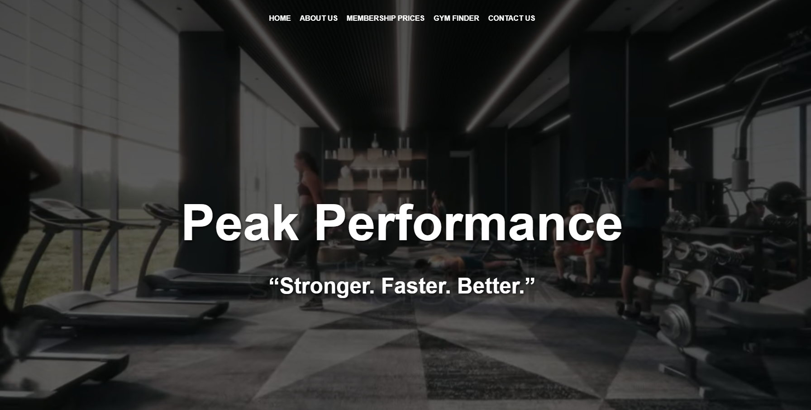
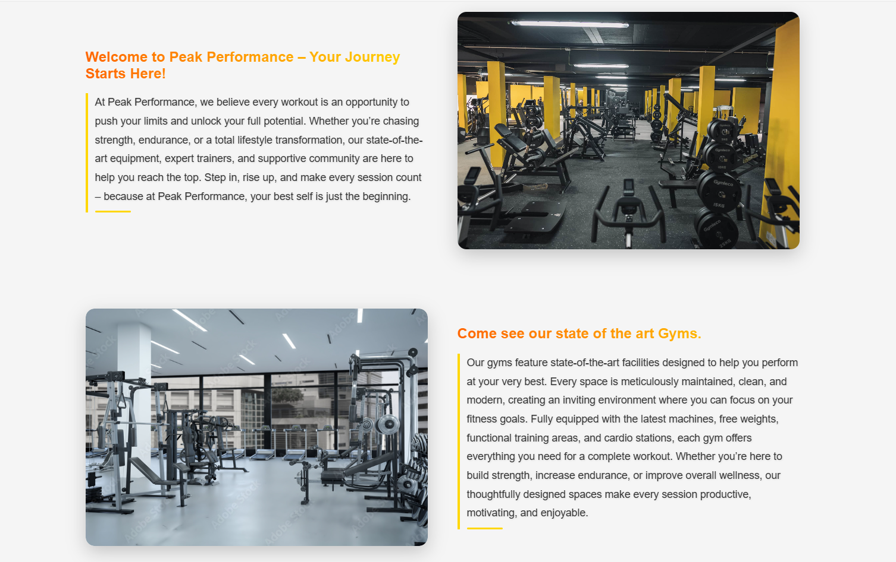
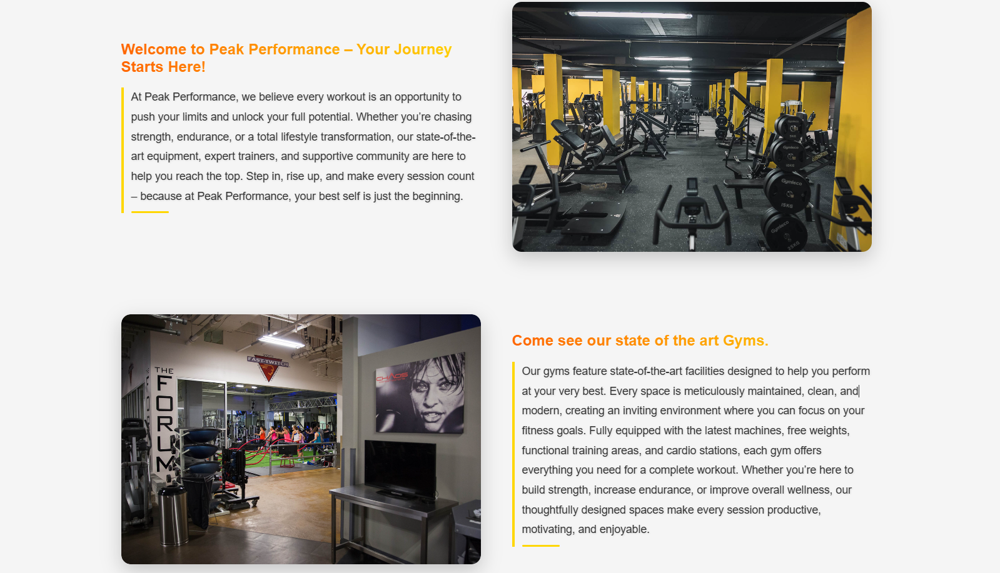
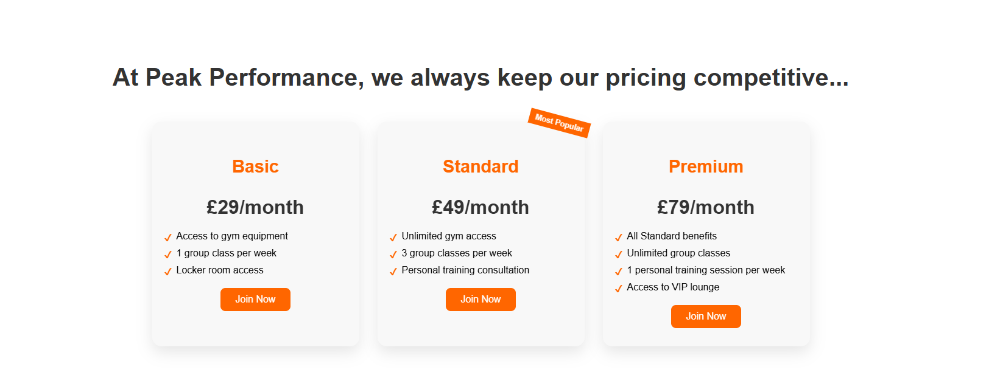
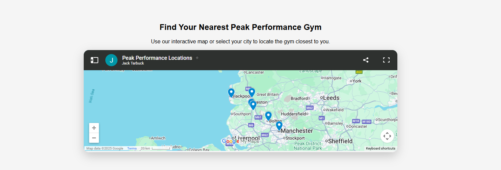
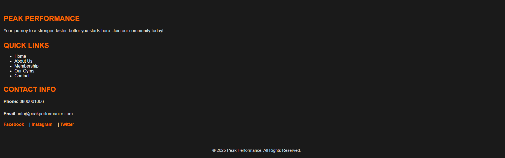

# Website Idea for a Gym
A website idea I have created for a fake gym called 'Peak Performance'. Made with HTML, CSS &amp; JavaScript.

Like my coffee shop idea, this website is designed to encourage people to use Peak Performance over any other gym.

The website begins with a navigation section, a video playing behind it and text that appears when you first load the website.

Following on from this, there is a 'about us' section which describes the gym, equipment and staff members. 
I have used JavaScript to make the images transition through eachother. Creating a slideshow effect.

Next up is the 'memberships section'. 
The middle tier membership has a 'most popular' ribbon on it, making it more attractive to screen users.
The memberships are also animated when hovered over and will look like they are about to be selected.

Moving on there is a 'store finder' section, which shows the location of Peak Performance across the north west. 
This is not a real business, so I have amended various gym groups to add some realism.

Finally, the page finishes with a 'footer' section.
The footer section is nice and simple, linking the webpage to the companies Facebook, Instagram and Twitter.
As well as providing a contact number and email address.

Really enjoyed this one!
I am hoping I can make enough projects to show I am capable of becoming a full time Front End Developer. 
This feels like another step in the right direction.
Next up - a festival website.
